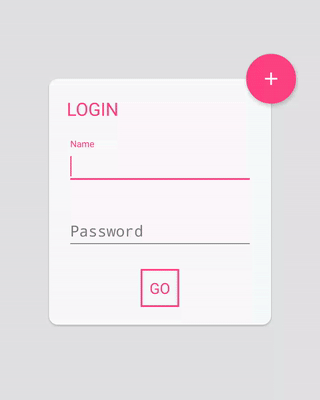

# MaterialLogin

A material-designed login (and register) view




Usage
-----

Add the LoginView to your layout

```xml
<?xml version="1.0" encoding="utf-8"?>
<FrameLayout
    xmlns:android="http://schemas.android.com/apk/res/android"
    android:layout_width="match_parent"
    android:layout_height="match_parent">

    <shem.com.materiallogin.LoginView
        android:id="@+id/login"
        android:layout_width="match_parent"
        android:layout_height="match_parent"/>
</FrameLayout>
```

Then set your `LoginViewListener` to the view in code to handle register and login events:
```java
final LoginView login = (LoginView) findViewById(R.id.login);
login.setListener(new LoginViewListener() {
    @Override
    public void onRegister(TextInputLayout registerUser, TextInputLayout registerPass, TextInputLayout registerPassRep) {
        //Handle register
    }

    @Override
    public void onLogin(TextInputLayout loginUser, TextInputLayout loginPass) {
        //Handle login
    }
});
```

You can also fork the project and see the example app.


Download
--------

Grab via Gradle:
```groovy
compile 'com.github.shem:material-login:1.0.0'
```
or Maven:
```xml
<dependency>
  <groupId>com.github.shem</groupId>
  <artifactId>material-login</artifactId>
  <version>1.0.0</version>
</dependency>
```


Thanks
--------

I first saw this design by the graet [Boris Borisov][1] and thought it will be nice to make it available on Android apps.


Contact Me
-----------

Pull requests are more than welcome, I'm planning to add lots of optins to customize the view, and hope to do this soon.
You can also contact me by mail: smagnezi8@gmail.com


License
--------

    Copyright 2015 Shem Magnezi

    Licensed under the Apache License, Version 2.0 (the "License");
    you may not use this file except in compliance with the License.
    You may obtain a copy of the License at

       http://www.apache.org/licenses/LICENSE-2.0

    Unless required by applicable law or agreed to in writing, software
    distributed under the License is distributed on an "AS IS" BASIS,
    WITHOUT WARRANTIES OR CONDITIONS OF ANY KIND, either express or implied.
    See the License for the specific language governing permissions and
    limitations under the License.
    
    
[1]: http://www.materialup.com/posts/compact-login
